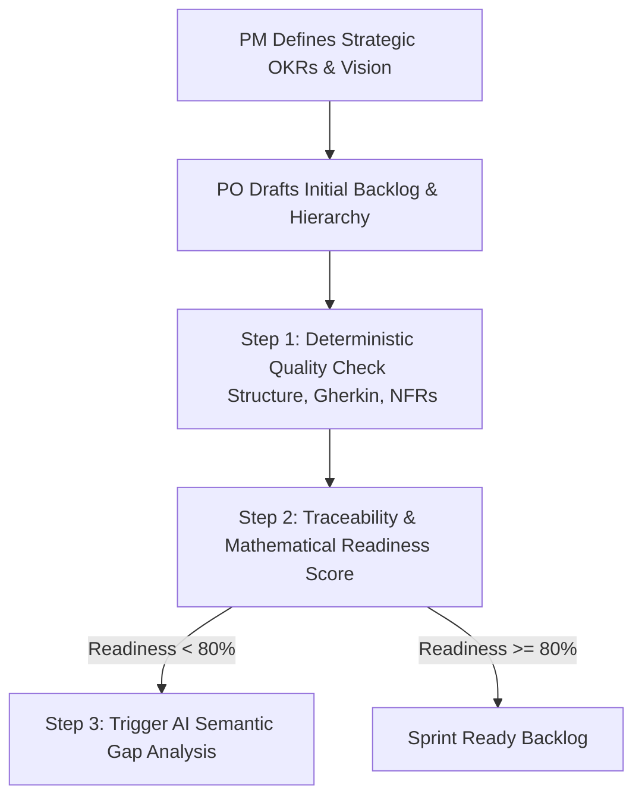

# Discovery Interview Notes - Product Manager (MVP Definition)
**Role Profile**: Senior Product Manager (AI-Led Product Strategy)  
**Context**: Helping a Product Owner (PO) define their first AI-led MVP to check backlog quality, ensuring a focused, structured backlog that aligns with PM-defined strategic OKRs and product vision.

---

## 📅 Refinement & Alignment Cycle

The PM and PO align on the backlog lifecycle using a hybrid strategy:

*   **Upstream PM Definition**: PM establishes the high-level OKRs and product vision (copied manually into the tool).
*   **Backlog Quality Audit**: The PO evaluates story formatting, Gherkin syntax, and the 6 key NFRs.
*   **Threshold-Triggered AI**: To conserve API token costs and response times, AI is only triggered if the mathematical readiness score of the backlog falls below **80%**.

---

## ⚠️ Frustrations & Pain Points

1.  **Prioritization Challenges**: Generic backlogs lead to implementation gaps because developers lack technical scenarios, and testers lack clear BDD criteria.
2.  **Scope Creep in AI-Led Tools**: The temptation to use AI (LLMs) for all quality checks leads to high API costs, slow response times, and hallucinated scores for basic formatting rules.
3.  **UI Friction / Data-Entry Burnout**: Forcing POs to manually click and build nested hierarchies (Epic -> Feature -> Story) directly in UI forms is highly tedious and leads to poor adoption.

---

## 🎯 Target State / Success Criteria (v1 MVP)

To solve these frustrations, the PM and PO locked down a focused MVP feature set:
1.  **Uniformity via CSV Templates**: Provide a downloadable CSV template inside the tool. POs can download, update, and upload their hierarchy (Epic, Feature, Story) in a structured format.
2.  **Split Mode (Single vs. Bulk)**:
    *   *Option 1 (Single-Story Focus)*: Fast, real-time evaluation of a single story. The OKR mapping field is disabled in this mode (focusing purely on story writing quality).
    *   *Option 2 (Backlog List View)*: Uploads the CSV, quantifies the number of features and stories under each Epic, and calculates OKR readiness.
3.  **Hybrid AI Gap Analysis**: If the mathematical traceability/readiness is below **80%**, the AI runs semantic checks to audit the backlog's substance against the PM's OKRs and recommends missing stories.
4.  **6 Core NFR Scanners**: Audits stories for:
    *   *Performance* (latency, speed)
    *   *Scalability* (concurrency, size limits)
    *   *Load Testing* (benchmarks, stress tests)
    *   *Stability* (uptime SLAs, failover)
    *   *Security* (RBAC roles, authentication)
    *   *Documentation* (audit logs, user manuals)

---

## 🛡️ Tool Alignment

The **Backlog Quality Review Web Portal** implements these boundaries:
*   **CSV Uploader/Downloader**: Simplifies data entry by using a standard template.
*   **Disabled OKR Field in Option 1**: Ensures focus remains on story structural quality when testing one story.
*   **Mathematical & AI Coverage Panels**: Displays mathematical percentage scores, but opens a detailed "AI Semantic Recommendation" pane if the score drops below 80%.
