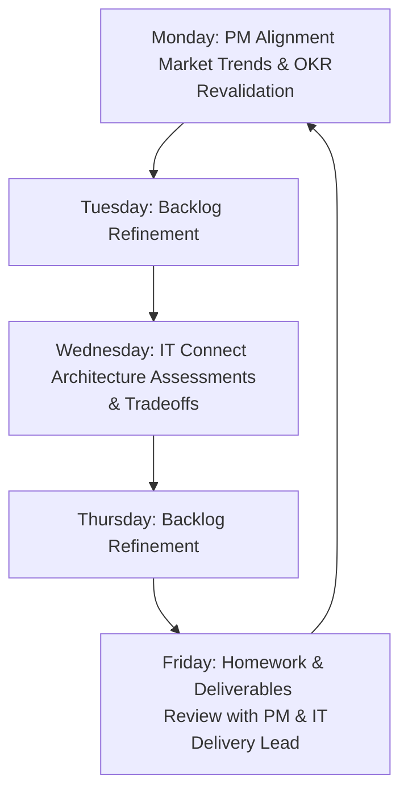

# Discovery Interview Notes - Product Owner (DAM Program)
**Role Profile**: Product Owner (Asset Lifecycle Management Program)  
**Context**: Mid-size enterprise building a standardized Digital Asset Management (DAM) strategy, handling asset conceptualization, quality/format standardization, ingestion, consumption by downstream systems, and archival/sunset.

---

## 📅 Refinement & Alignment Cycle

The Product Owner (PO) and Product Manager (PM) follow a structured weekly cycle to refine the backlog based on market trends, technical limitations, and IT feasibility checks:

*   **Mondays**: Market trends assessment, OKR revalidation, and review of end-user interview documentation.
*   **Tuesdays & Thursdays**: Backlog refinement sessions.
*   **Wednesdays**: "IT Connect" alignment. Technical leads and solution architects bring project decision logs and architecture review assessments. Tradeoff discussions take place between **business value** and **venture value**.
*   **Fridays**: Consolidation of backlog modifications ("doing the homework") and sharing with the PM and IT Delivery Lead.

---

## ⚠️ Frustrations & Pain Points

1.  **Synthesizing Diverse Documentation**: Collating inputs from disparate sources (decision logs, user interview records, architecture assessments, OKR targets) and translating technical jargon into clear, techno-functional user stories.
2.  **Missing Non-Functional Requirements (NFRs)**: Security, role-based access constraints (RBAC), and performance SLAs are often overlooked during initial story writing.
    *   *Real-World Example*: A requirement was drafted for managing restricted, confidential documents. It was planned and pulled into a sprint without aligning on access permissions for an overlapping user group.
    *   *Business Impact*: The conflict was discovered mid-sprint. The team had to emergency-deprioritize the story, hold an ad-hoc Scrum of Scrums (SoS) to align, and scramble to reprioritize other work to salvage the sprint, delaying overall Time-to-Market.
3.  **Cross-Team & Release Train Overlaps**: Overlapping requirements with other teams or release trains are sometimes identified too late (mid-sprint), causing deadlock dependencies.

---

## 🎯 Target State / Success Criteria

To establish a resilient backlog management flow, three core targets were identified:
1.  **Dependency & Conflict Resolution**: Capture cross-release train impacts early.
2.  **Upstream PO/PM Alignment**: Validate OKR-to-Epic conversions before writing individual stories.
3.  **Cross-Train Architecture Assessments**: Run technical reviews at the release train level prior to Epic sign-off.
4.  **Automatic Breakdown**: Story Point estimations of **13 or more** are deemed too heavy and must be split functionally by scenario/role behavior (allowing technical sub-tasking to be handled separately by the devs). This ensures deliverables are ready by the second Wednesday of the sprint, leaving ample time for testing, demo validation, and PO review.

---

## 🛡️ Tool Alignment

The **Backlog Quality Review Web Portal** directly resolves these frustrations:
*   **Interactive Input Fields**: Allows direct manual input or batch CSV/PDF uploads for Epics, Features, User Stories, OKRs, and KPIs.
*   **Real-time Scoring & Checklist**: Evaluates template structure (As a/I want to/So that) and Gherkin BDD criteria (Given/When/Then) so requirements are clear to both developers and testers.
*   **Traceability Path**: Traces Epic and Feature mappings back to OKRs/KPIs to verify outcome alignment.
*   **NFR Scanners**: Audits stories for Security & RBAC, Performance SLAs, Reliability/Audit logs, and Usability to ensure non-functional requirements are not forgotten.
*   **Story Breakdown Helper**: Flags stories that exceed 8 Story Points or 3 scenarios, recommending clear, scenario-based splits that can be applied with a single click.
