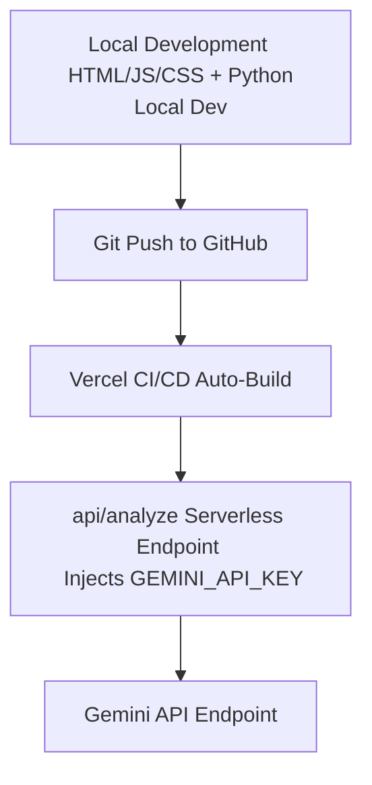

# Discovery Interview Notes - Staff Engineer (Architecture Review)
**Role Profile**: Staff Engineer / Technical Architect  
**Context**: Reviewing the technical architecture, stack, deployment, and security trade-offs for the AI-led MVP backlog review tool. Offloading AI API orchestration to a secure backend to maximize ease of use and protect API credentials.

---

## 📅 Refinement & Alignment Cycle

The Staff Engineer outlines the deployment and integration lifecycle:



*   **Continuous Deployment**: Every push to Git triggers a build in Vercel, deploying the static files and the `/api/` endpoints simultaneously.
*   **Security Boundary**: The client-side application never sees the Gemini API key. All AI calls go through the serverless proxy.

---

## ⚠️ Technical Risks & Mitigations

1.  **Risk: API Key Exposure**: Pasting API keys in the frontend is risk-prone and creates friction for UAT stakeholders.
    *   *Mitigation*: Implement Vercel Serverless Functions (`api/analyze.py` or `.js`) and store the `GEMINI_API_KEY` in Vercel's encrypted Environment Variables.
2.  **Risk: Cold Starts & 2-Week Timeline**: Setting up a full virtual private server (VPS), Docker, or Kubernetes clusters will consume the UAT launch timeline.
    *   *Mitigation*: Use zero-configuration serverless functions.

---

## 🏗️ Recommended Target Architecture

### 1. File Structure (with Serverless Backend)
```text
├── api/
│   └── analyze.js       # Serverless function (handles Gemini API proxying)
├── public/              # Static Frontend Assets
│   ├── index.html       # UI Layout
│   ├── style.css        # Glassmorphic Styling
│   ├── app.js           # UI Bindings & DOM updates
│   ├── data.js          # Workbook Reference Guide
│   └── evaluator.js     # Mathematical quality evaluation
├── docs/                # Discovery documentation
├── package.json         # Backend dependencies (e.g. @google/generative-ai)
└── vercel.json          # Routing configuration for UAT hosting
```

### 2. Stack Components
*   **Hosting**: Vercel (Hobby Tier: Free, secure HTTPS, automatic GitHub integration).
*   **Proxy Endpoint**: Node.js/Javascript or Python backend serverless function.
